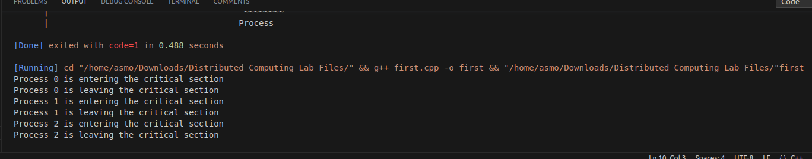

# Assignment 1

### Aim: 
Program to implement non token based algorithm for Mutual Exclusion.
### Theory:
Mutual exclusion ensures that only one process accesses a shared resource at a time, preventing data inconsistencies. Non-token based algorithms achieve mutual exclusion through message passing and coordination among processes. Algorithms like Ricart-Agrawala use timestamps and request-reply messages, while Maekawa's algorithm employs a quorum-based approach. Non-token based algorithms offer scalability, flexibility, and fault tolerance, making them suitable for distributed systems.

### Code implementation:
```cpp
#include <iostream>
#include <vector>

using namespace std;

// Define a struct to represent a request message
struct RequestMessage {
  int processId;
};

// Define a struct to represent a reply message
struct ReplyMessage {
  int processId;
};

// Define a class to represent a process
class Process {
private:
  int id;
  vector<RequestMessage> pendingRequests;
  vector<ReplyMessage> receivedReplies;
  bool inCriticalSection = false;

public:
  Process(int id) {
    this->id = id;
  }

  // Send a request message to all other processes
  void sendRequest() {
    RequestMessage requestMessage;
    requestMessage.processId = id;

    for (int i = 0; i < processes.size(); i++) {
      if (i != id) {
        processes[i].receiveRequest(requestMessage);
      }
    }
  }

  // Receive a request message from another process
  void receiveRequest(RequestMessage requestMessage) {
    pendingRequests.push_back(requestMessage);

    if (!inCriticalSection) {
      sendReply(requestMessage.processId);
    }
  }

  // Send a reply message to the requesting process
  void sendReply(int requestingProcessId) {
    ReplyMessage replyMessage;
    replyMessage.processId = id;

    processes[requestingProcessId].receiveReply(replyMessage);
  }

  // Receive a reply message from another process
  void receiveReply(ReplyMessage replyMessage) {
    receivedReplies.push_back(replyMessage);

    if (canEnterCriticalSection()) {
      enterCriticalSection();
    }
  }

  // Check if the process can enter the critical section
  bool canEnterCriticalSection() {
    return receivedReplies.size() == processes.size() - 1;
  }

  // Enter the critical section
  void enterCriticalSection() {
    cout << "Process " << id << " is entering the critical section" << endl;

    // Simulate critical section execution
    sleep(1);

    cout << "Process " << id << " is leaving the critical section" << endl;

    inCriticalSection = false;
    pendingRequests.clear();
    receivedReplies.clear();
  }
};

// Define a vector to store all processes
vector<Process> processes;

int main() {
  // Create three processes
  processes.push_back(Process(0));
  processes.push_back(Process(1));
  processes.push_back(Process(2));

  // Let each process try to enter the critical section
  for (int i = 0; i < processes.size(); i++) {
    processes[i].sendRequest();
  }

  while (true) {
    for (int i = 0; i < processes.size(); i++) {
      if (processes[i].canEnterCriticalSection()) {
        processes[i].enterCriticalSection();
      }
    }
  }

  return 0;
}
```
### Code explanation:
This code implements a non-token based algorithm for mutual exclusion using a simple request-reply mechanism. In this algorithm, each process sends a request message to all other processes before entering the critical section. A process can only enter the critical section if it has received a reply message from all other processes.

Here's a breakdown of the code:

1. **RequestMessage and ReplyMessage structs:** These structs define the structure of request and reply messages exchanged between processes.
    
2. **Process class:** This class represents a process and encapsulates its behavior, including sending and receiving request and reply messages, checking if it can enter the critical section, and entering the critical section.
    
3. **Main function:** This function creates three processes and simulates their execution, allowing them to enter the critical section one at a time.

### Output:

