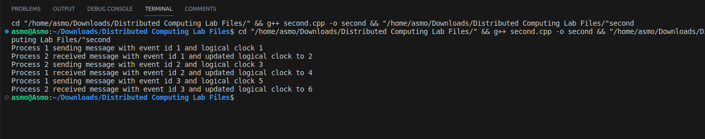

# Assignment 2

### Aim: 
Program to implement Lamport’s Logical Clock
### Theory:
Lamport's logical clock is a mechanism for capturing the order of events in a distributed system. In a distributed system, there is no single global clock that all processes can access. This makes it difficult to determine the order in which events occur. Lamport's logical clock provides a way to partially order events, even in the absence of a global clock.

Each process in a distributed system maintains its own logical clock, which is a counter that is incremented whenever the process sends or receives a message. When a process sends a message, it includes its current logical clock value in the message. When a process receives a message, it updates its logical clock to be the maximum of its current logical clock value and the logical clock value in the message.

Lamport's logical clock can be used to determine the order of events in a distributed system. If two events occur on the same process, the event with the smaller logical clock value happened first. If two events occur on different processes, the event with the smaller logical clock value happened first, or the events are concurrent.
### Code implementation:
```cpp
#include <iostream>

using namespace std;

class Process {
private:
  int id;
  int logicalClock;

public:
  Process(int id) {
    this->id = id;
    this->logicalClock = 0;
  }

  void incrementLogicalClock() {
    logicalClock++;
  }

  void sendMessage(Process& receiver, int eventId) {
    logicalClock++;
    cout << "Process " << id << " sending message with event id " << eventId << " and logical clock " << logicalClock << endl;
    receiver.receiveMessage(*this, eventId);
  }

  void receiveMessage(Process& sender, int eventId) {
    logicalClock = max(logicalClock, sender.logicalClock) + 1;
    cout << "Process " << id << " received message with event id " << eventId << " and updated logical clock to " << logicalClock << endl;
  }
};

int main() {
  Process p1(1);
  Process p2(2);

  p1.sendMessage(p2, 1);
  p2.sendMessage(p1, 2);
  p1.sendMessage(p2, 3);

  return 0;
}
```
### Code explanation:
This code simulates the exchange of messages between two processes, p1 and p2, using Lamport's logical clock. Each process maintains its own logical clock, which is incremented whenever the process sends or receives a message. When a process sends a message, it includes its current logical clock value in the message. When a process receives a message, it updates its logical clock to be the maximum of its current logical clock value and the logical clock value in the message.

The code demonstrates how Lamport's logical clock can be used to determine the order of events in a distributed system. In this example, the events are the sending and receiving of messages. The logical clock values ensure that the events are ordered correctly, even though they occur on different processes.

### Output:
