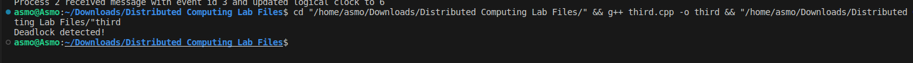

# Assignment 3

### Aim: 
Program to implement edge chasing distributed deadlock detection algorithm.
### Theory:
The edge chasing algorithm is a distributed deadlock detection algorithm that identifies deadlocks in a system of distributed processes. It works by sending probe messages along the edges of a wait-for graph, which represents the dependencies between processes waiting for resources. If a probe message returns to its initiator, it indicates a cycle in the graph, implying a deadlock.

### Code implementation:
```cpp
#include <iostream>
#include <vector>

using namespace std;

struct Process {
  int id;
  int waitingFor;
};

vector<Process> processes;

void detectDeadlock(int initiator) {
  int currentProcess = initiator;
  int nextProcess = processes[currentProcess].waitingFor;

  while (nextProcess != initiator) {
    currentProcess = nextProcess;
    nextProcess = processes[currentProcess].waitingFor;
  }

  if (nextProcess == initiator) {
    cout << "Deadlock detected!" << endl;
  } else {
    cout << "No deadlock detected" << endl;
  }
}

int main() {
  // Create three processes and their waiting dependencies
  processes.push_back({0, 2});
  processes.push_back({1, 0});
  processes.push_back({2, 1});

  // Initiate deadlock detection from process 0
  detectDeadlock(0);

  return 0;
}
```
### Code explanation:
This code simulates the edge chasing algorithm for deadlock detection. It creates three processes with a circular dependency, representing a deadlock situation. The `detectDeadlock` function follows the waiting dependencies, starting from the initiator process. If it encounters the initiator process again, it indicates a cycle and a deadlock.

### Output:
