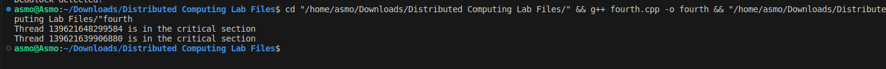

# Assignment 4

### Aim: 
Program to implement locking algorithm.
### Theory:
Locking algorithms are crucial for ensuring mutual exclusion in concurrent programming. They prevent multiple processes or threads from accessing a shared resource simultaneously, preventing data corruption and inconsistencies. Locking algorithms typically involve acquiring and releasing locks to control access to the critical section, the code segment where the shared resource is accessed.

### Code implementation:
```cpp
#include <iostream>
#include <mutex>

using namespace std;

mutex mtx; // Global mutex object

void criticalSection() {
  // Acquire the lock before entering the critical section
  mtx.lock();

  // Simulate critical section execution
  cout << "Thread " << this_thread::get_id() << " is in the critical section" << endl;

  // Release the lock after exiting the critical section
  mtx.unlock();
}

int main() {
  thread t1(criticalSection);
  thread t2(criticalSection);

  t1.join();
  t2.join();

  return 0;
}
```
### Code explanation:
This code demonstrates a simple locking mechanism using a mutex object. The `criticalSection` function acquires the lock before entering the critical section, ensuring exclusive access to the shared resource. After exiting the critical section, the lock is released, allowing other threads to acquire it.

The code uses a global mutex object, `mtx`, for synchronization. The `lock()` and `unlock()` methods control access to the critical section. The `this_thread::get_id()` function identifies the current thread.

### Output:
