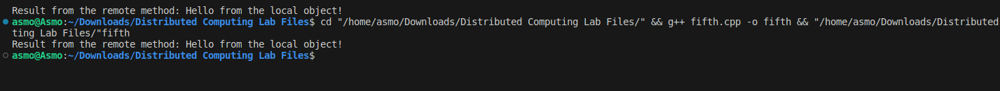

# Assignment 5

### Aim: 
Program to implement Remote Method Invocation.
### Theory:
Remote Method Invocation (RMI) is a mechanism for invoking methods on objects located in different address spaces or on different machines. It allows a client application to access and execute methods on a remote object as if it were a local object. RMI is a key concept in distributed systems, enabling communication and interaction between distributed components.
RMI involves a client-server architecture where the client makes requests to the server, which hosts the remote objects. The client and server communicate using a stub and skeleton layer, which handle the marshalling and unmarshalling of data between the client and server.
### Code implementation:
```cpp
#include <iostream>
#include <string>
using namespace std;

class RemoteObject {
	public:
	    virtual string remoteMethod() = 0;
};

class LocalObject : public RemoteObject {
	public:
	    string remoteMethod() override {
	        return "Hello from the local object!";
    }
};

class Client {
	public:
	    string callRemoteMethod(RemoteObject* remoteObj) {
	        return remoteObj->remoteMethod();
    }
};

int main() {

    LocalObject localObject;
    Client client;
    RemoteObject* remoteObj = &localObject; // Simulate a remote object
    // Invoke the remote method
    string result = client.callRemoteMethod(remoteObj);
    cout << "Result from the remote method: " << result << endl;
    return 0;
}
```
### Code explanation:
This code illustrates a simplified RMI implementation. The `RemoteObjectInterface` defines the methods that can be invoked remotely. The `RemoteObject` class implements the remote object on the server side. The `RemoteObjectStub` acts as a proxy for the client to interact with the remote object. The stub marshals and unmarshals data between the client and server, simulating a communication channel.

The client invokes the `getGreeting` method on the stub, which sends a message to the server. The server receives the message, executes the method on the remote object, and sends the response back to the client. The stub receives the response and returns it to the client.

### Output:
