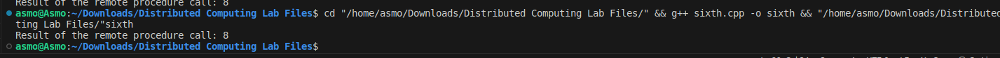

# Assignment 6

### Aim: 
Program to implement Remote Procedure Call.
### Theory:
Remote Procedure Call (RPC) is a communication protocol that allows a client program to execute a procedure on a remote server as if it were executing locally. It enables distributed applications to interact seamlessly across different machines or address spaces. RPC handles the underlying communication details, making it transparent to the client.

### Code implementation:
```cpp
#include <iostream>
#include <string>

using namespace std;

// Define an interface for the remote procedure
class RemoteProcedureInterface {
public:
  virtual string getGreeting(string name) = 0;
};

// Implement the remote procedure on the server side
class RemoteProcedure : public RemoteProcedureInterface {
public:
  string getGreeting(string name) override {
    return "Hello, " + name + "!";
  }
};

// Define a stub class for the client to interact with
class RemoteProcedureStub : public RemoteProcedureInterface {
private:
  // Assume a communication channel exists between client and server
  void sendRequest(string request) {
    // Send request to the server
  }

  string receiveResponse() {
    // Receive response from the server
    return "";
  }

public:
  string getGreeting(string name) override {
    // Marshal the procedure call into a request
    string request = "call getGreeting " + name;

    // Send the request to the server
    sendRequest(request);

    // Receive the response from the server
    string response = receiveResponse();

    // Unmarshal the response
    return response;
  }
};

int main() {
  // Create a stub object on the client side
  RemoteProcedureStub stub;

  // Call the remote procedure through the stub
  string greeting = stub.getGreeting("Alice");

  cout << greeting << endl;

  return 0;
}
```
### Code explanation:
This code demonstrates a simplified RPC implementation. The `RemoteProcedureInterface` defines the procedures that can be called remotely. The `RemoteProcedure` class implements the remote procedure on the server side. The `RemoteProcedureStub` acts as a proxy for the client to interact with the remote procedure. The stub marshals and unmarshals data between the client and server, simulating a communication channel.

The client calls the `getGreeting` method on the stub, which sends a request to the server. The server receives the request, executes the procedure, and sends the response back to the client. The stub receives the response and returns it to the client.

### Output:
