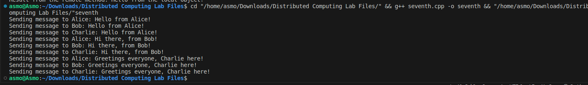

# Assignment 7

### Aim: 
Program to implement Chat Server.
### Theory:
A chat server is a central server that facilitates real-time text-based communication between multiple connected clients. It acts as a hub for receiving and distributing messages among the participants. Chat servers are the backbone of online chat applications and messaging platforms.

### Code implementation:
```cpp
#include <iostream>
#include <vector>

using namespace std;

class Client {
private:
  string name;

public:
  Client(string name) {
    this->name = name;
  }

  string getName() {
    return name;
  }
};

vector<Client> clients;

void broadcastMessage(string message) {
  for (Client& client : clients) {
    cout << "Sending message to " << client.getName() << ": " << message << endl;
  }
}

int main() {
  // Add some clients to the chat
  clients.push_back(Client("Alice"));
  clients.push_back(Client("Bob"));
  clients.push_back(Client("Charlie"));

  // Simulate receiving messages from clients and broadcasting them
  broadcastMessage("Hello from Alice!");
  broadcastMessage("Hi there, from Bob!");
  broadcastMessage("Greetings everyone, Charlie here!");

  return 0;
}

```
### Code explanation:
This code simulates a simple chat server that maintains a list of connected clients and broadcasts messages to all of them. The `Client` class represents a connected client with a unique name. The `clients` vector stores all connected clients.

The `broadcastMessage` function iterates through the list of clients and sends the message to each one. The `getName` method retrieves the name of the client.

The main function adds a few clients to the chat and simulates receiving messages from them. It then calls the `broadcastMessage` function to distribute the messages to all connected clients.

### Output:

