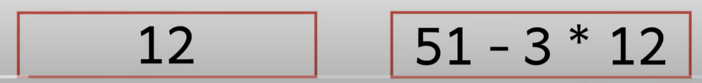
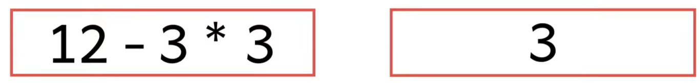
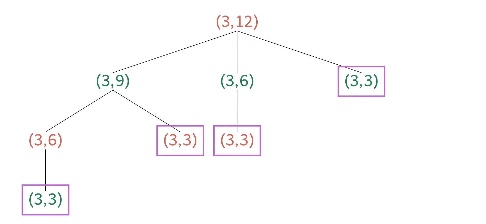
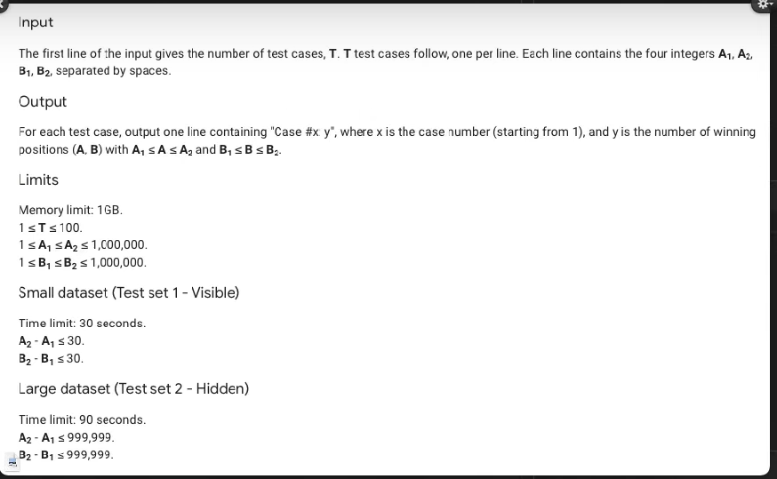

NUMBER GAME

problem statement: 
2 player game. arya and bran are playing a game.
initially, 2 positive integers A & B are written on a blackboard.
The players take turns, starting with arya. 
on their turn, a player can replace A wutth 'A-kB' or replace B with 'B-kA' for any positive integer k.
they cannot leave the numbers same as before, they have to change them.
the first person to make one of the numbers drop to 0 or below, looses. 

input 1:
A = 12, B = 51

the boxes around these numbers are color-coded  based on whose turn it is. So, if the boxes are red, then it is Arya's turn and if the boxes  are green, then it is Bran's turn

So, Arya, let us say she makes her first move by subtracting  3 copies of 12 from 51.

that would leave her with 15.

now, its bran's turn,

(A,B) is a "winning position" if arya can always win a game that starts with (A,B) on the blackboard, no matter what Bran does.

input 2:

whenever one of the number is 1, the player has an advantage and they can win this game in a single move. (think about it if you dont understand)

input 3:

not a winning pos for 1st player

(A,B) is a winning position if and only if A>=tB where t = threshold

